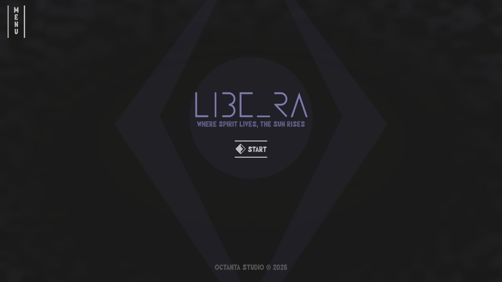
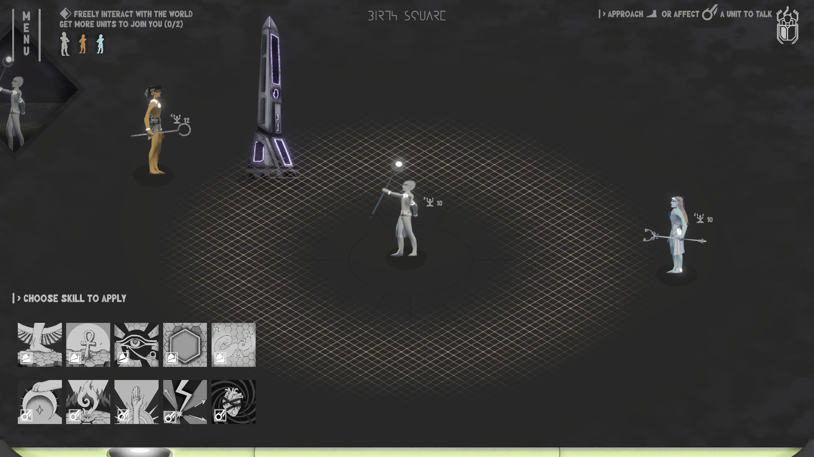
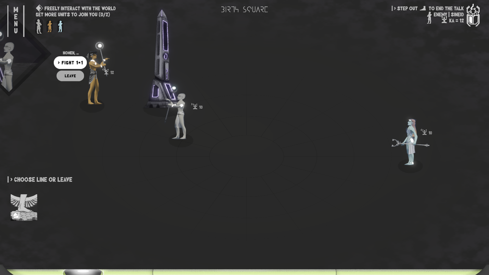
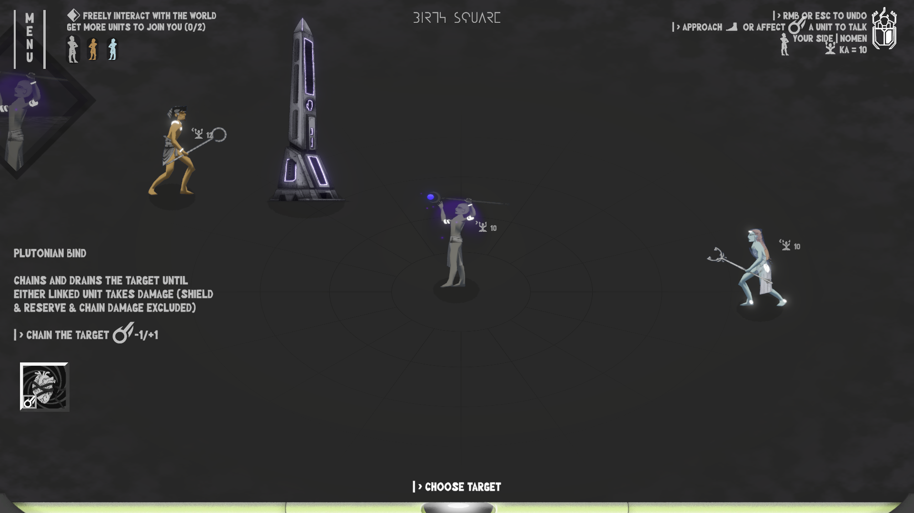
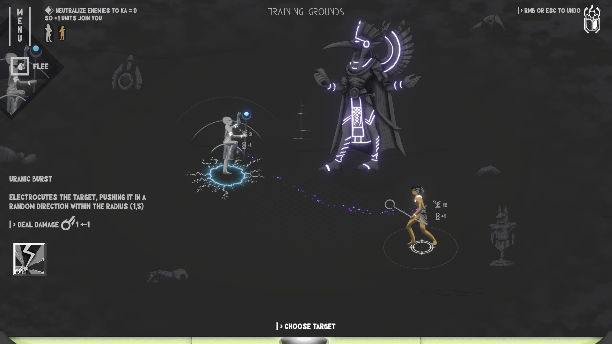
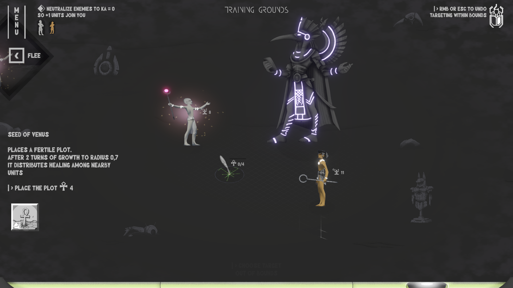
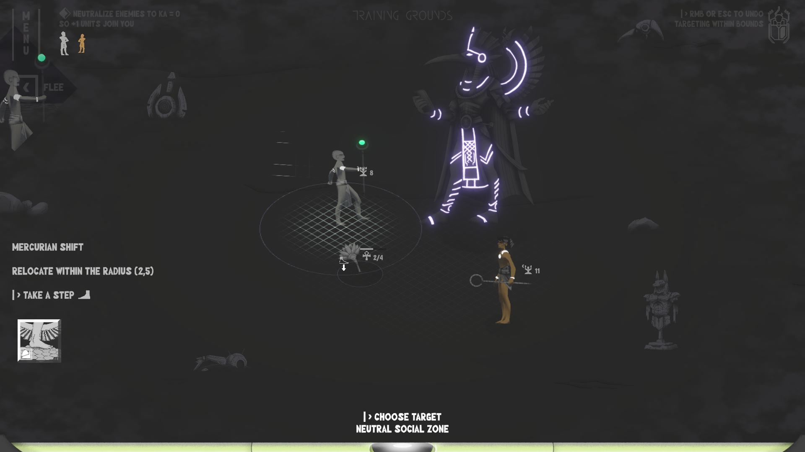
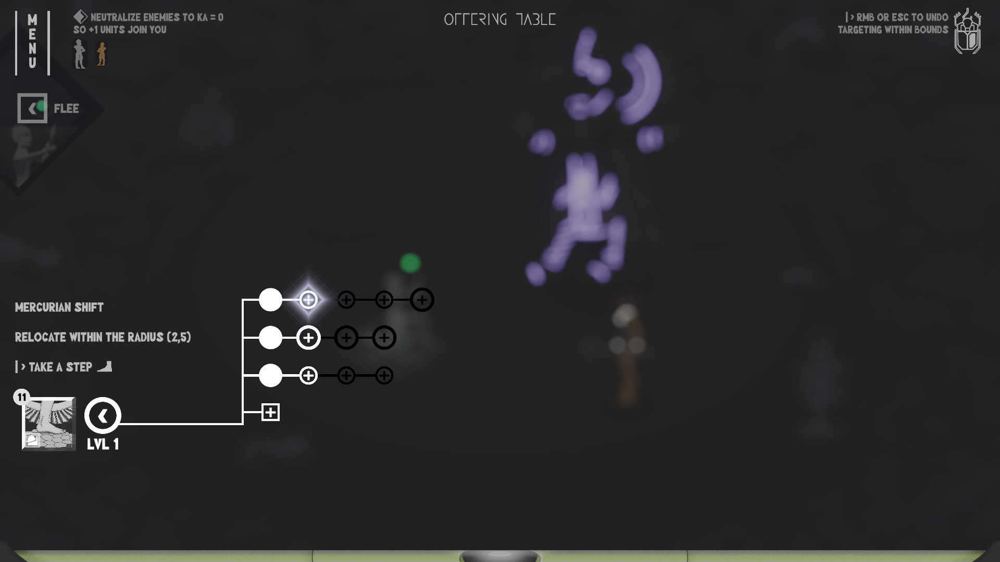
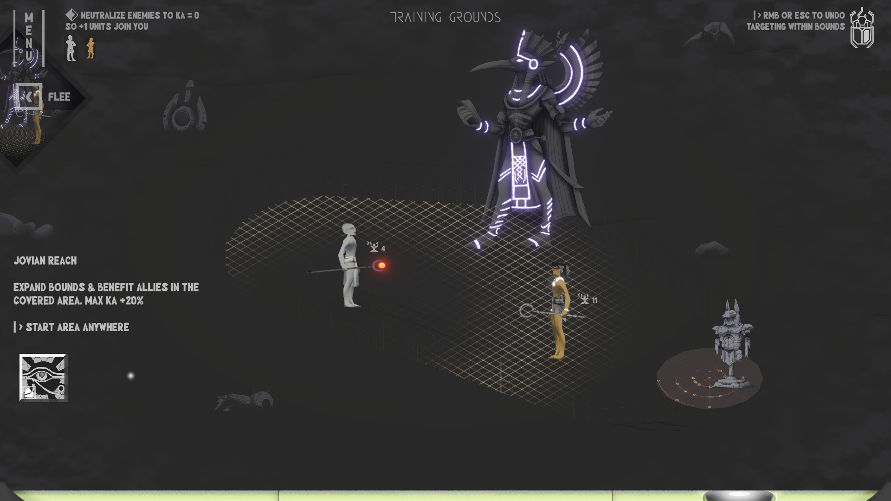
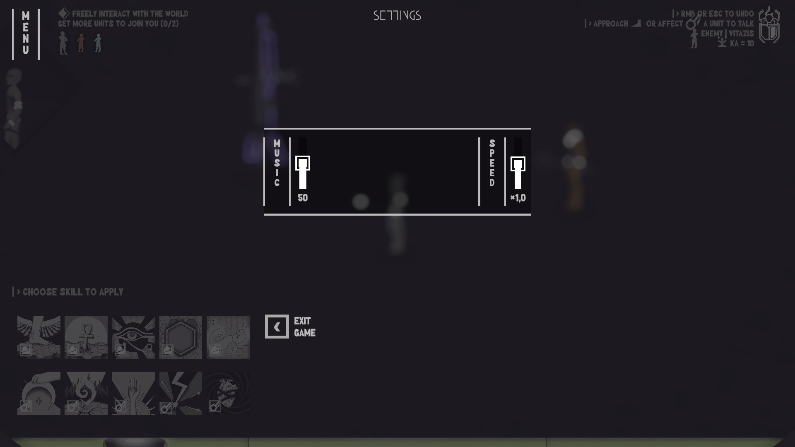

# Libe_Ra (working title)
[Download](#-download--play) · [Video](#-gameplay-video) · [Screenshots](#-screenshots) · [Budget](#-budget-breakdown--production-schedule) · [Team](#-team) · [Portfolio](#-portfolio) · [Resume](#resume)

## 📥 Download & Play

**Platform:** Windows PC  
**Build:** [Source >](https://github.com/octantast/Libe_Ra-application-data/tree/main/Build)

[[Download now](https://github.com/octantast/Libe_Ra-application-data/raw/refs/heads/main/Build/Libe_Ra_build.zip)]

1. Download and extract the `.zip` file
2. Run `Libe_Ra.exe`

📍 Current Stage

The project is past the prototype phase. A downloadable build delivers a complete gameplay loop: free-roam NPC interaction, a reputation system, turn-based combat with planetary skill sets, mid-battle skill upgrades, field expansion with object spawn, and basic settings. Core visual identity - b/w + purple Egyptian aesthetic, custom shaders, geometric UI.

## 🎮 Gameplay Video

## 🖼 Screenshots

| | |
|:---:|:---:|
|  |  |
| *Main menu* | *Free roaming with full skill access - interact with environment and units* |
|  |  |
| *A skill applied to a unit triggers dialogue; the unit demands combat before joining* | *Out-of-combat attacks deal no damage but trigger dialogue and damage reputation. Better to approach with Mercury steps* |
|  |  |
| *Targeting an enemy in combat - reduce their KA to zero to win* | *Turn-based combat: summoning a healing flower within the field* |
|  |  |
| *Turn-based combat: moving toward the flower to restore KA next turn* | *Skill progression: upgrade points accumulate with each use, upgrades available mid-battle* |
|  |  |
| *Expanding the battle field to include background objects - useful in combat and quests* | *Settings* |

## 💴 Budget Breakdown & Production Schedule

**Total: $5,000 · approx. 800,000 JPY**

| Item | Cost |
|------|------|
| Fullstack Developer / Artist / Narrative Designer - 6 months · $700/mo | $4,200 |
| Sound Design - fixed price | $500 |
| Steam Direct fee + contingency | $300 |

**Production Schedule:** Full Chapter 1 release on Steam by December 31, 2026 (6 months)

Chapter 1 scope includes: several quests involving NPCs, items, and movement across locations, dialogues, designed combats and narrative arc resolution.

## 👥 Team

| Name | Role |
|------|------|
| **[Dariia](https://www.octantastudio.com/2024/08/30/dariia-kainis/)** | Fullstack Developer · Programmer · Artist · Narrative Designer |
| **[Yurii](https://www.octantastudio.com/2025/02/16/shvetsb/)** | Sound Designer |

All previous studio projects were completed by this team.

## 🗂 Portfolio

**Studio Website:** [octantastudio.com](https://www.octantastudio.com/)

### Games

| Title | Link | Status |
|-------|------|--------|
| Brotula | [itch.io](https://octantastudio.itch.io/brotula) | Released (2022) |
| Jewellirium | [itch.io](https://octantastudio.itch.io/jewellirium) | Released (2023) |
| Objectivity | [itch.io](https://octantastudio.itch.io/objectivity) | Mini Game, Jam Winner (2025) |

  &nbsp;&nbsp;
  &nbsp;&nbsp;
  

### Assets

Active publisher on the **Unity Asset Store** · [Publisher Page >](https://assetstore.unity.com/publishers/109611)

## Resume

The Egyptian KA - life-force of the soul - is a bionic charge in the player's body in a future city where myth and technology have merged. Combat is not about destruction: it's about conviction. Neutralize an opponent's spirit to zero, and they join your formation.
The player uses 10 planetary-mythological skills in both free-roam and combat. Approaching NPCs opens dialogue; an unconvinced NPC demands to be won over in battle; victory earns alliance. Recruited units unlock deeper access to the city's secrets. Defeat has a social cost: lost battles damage reputation with those involved, pushing future interactions from consent toward combat.
Skills grow stronger through use and can be upgraded or reconfigured mid-battle, rewarding tactical flexibility.
Beneath a utopian metropolis lies a dark mystery demanding clarity, will, and the right allies. The current build features NPC interaction, arena combat & skill progression.

The current plan follows a chapter-based structure. We are ready to adapt the development direction based on the publisher's feedback.

*© Octanta Studio 2026*
